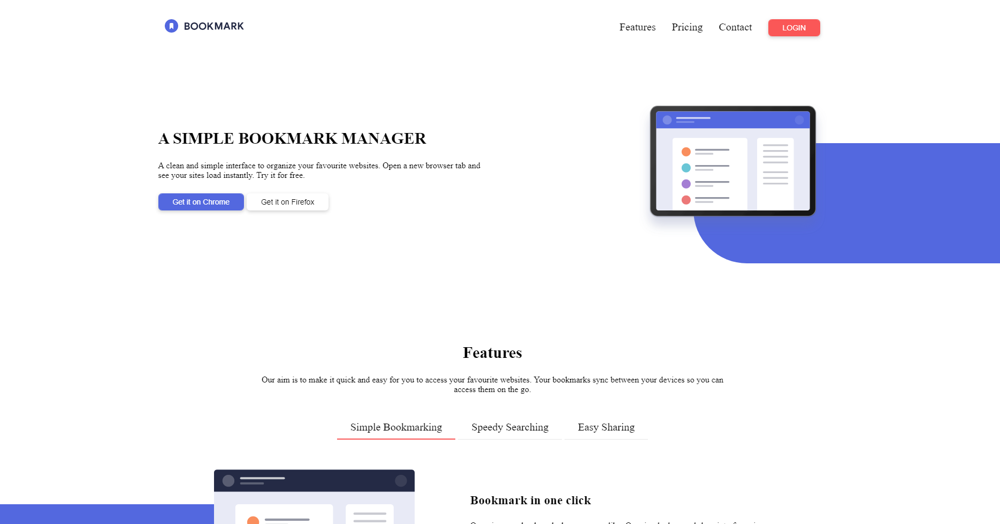
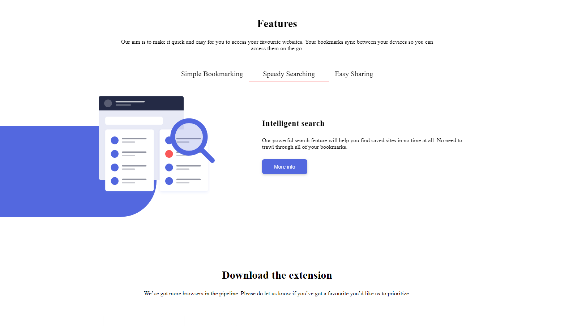
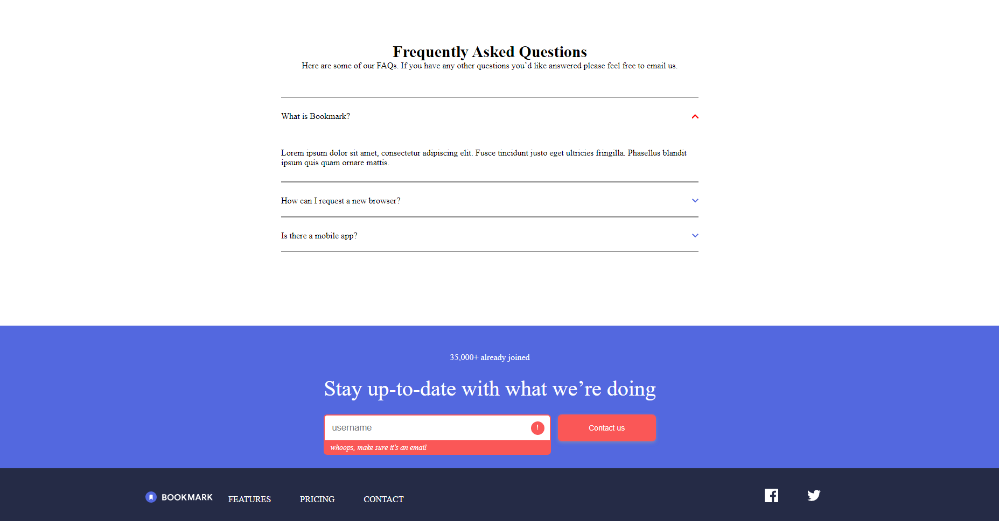

# Frontend Mentor - Bookmark landing page solution

This is a solution to the [Bookmark landing page challenge on Frontend Mentor](https://www.frontendmentor.io/challenges/bookmark-landing-page-5d0b588a9edda32581d29158). 
Frontend Mentor challenges help you improve your coding skills by building realistic projects. 

## Table of contents

- [Overview](#overview)
  - [The challenge](#the-challenge)
  - [Screenshot](#screenshot)
  - [Links](#links)
- [My process](#my-process)
  - [Built with](#built-with)
  - [What I learned](#what-i-learned)
  - [Continued development](#continued-development)
  - [Useful resources](#useful-resources)
- [Author](#author)


**Note: Delete this note and update the table of contents based on what sections you keep.**

## Overview

### The challenge

Users should be able to:

- View the optimal layout for the site depending on their device's screen size
- See hover states for all interactive elements on the page
- Receive an error message when the newsletter form is submitted if:
  - The input field is empty
  - The email address is not formatted correctly

### Screenshot






### Links

- Solution URL: [Add solution URL here](https://your-solution-url.com)
- Live Site URL: [Add live site URL here](https://your-live-site-url.com)

## My process

### Built with

- Semantic HTML5 markup
- CSS custom properties
- Flexbox
- javascript

### What I learned
i learnt how to implement sliders and a drop down menu, i tried building it without relying on google.
the slider was quite difficult to implement, i am not quite satisfied with how it works. i had to create a function that creates an animation for each case scenerio of the slider. currently the slider is quite static, what i mean is if i were to add a new slide i will have to create a new animation class for the slide.
```js
the fuction for moving the slide

function intToClass(previous,current){
    let str = ''
   switch (previous) {
    case 1:
         str = 'one'
        break;
    case 2:
        str = 'two'
        break;
    case 3:
        str = 'three'
        break;
    default:
        break;
   }

   switch (current) {
    case 1:
         str = `${str}-to-one`
        break;
    case 2:
        str = `${str}-to-two`
        break;
    case 3:
        str = `${str}-to-three`
        break;
    default:
        break;
   }
   return str;
}
```
### Continued development
i will continue to focus my attention more on how to build better slide menus and drop down menus

### Useful resources

- [Example resource 1](https://stackoverflow.com/questions/45500104/how-can-i-check-if-the-value-of-an-input-is-an-email-type) - This helped me with the regex for email validation

## Author

- Website - [Add your name here](https://www.your-site.com)
- Frontend Mentor - [@yourusername](https://www.frontendmentor.io/profile/yourusername)
- Twitter - [@yourusername](https://www.twitter.com/yourusername)

**Note: Delete this note and add/remove/edit lines above based on what links you'd like to share.**

